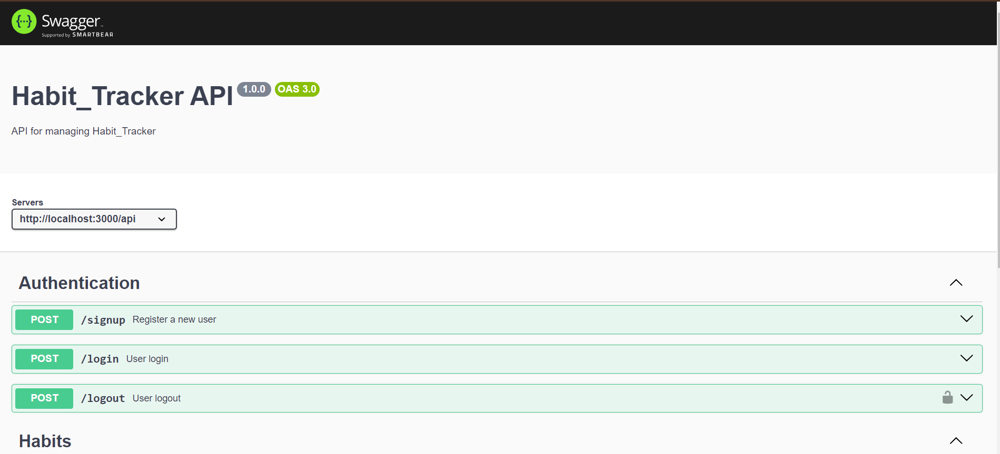
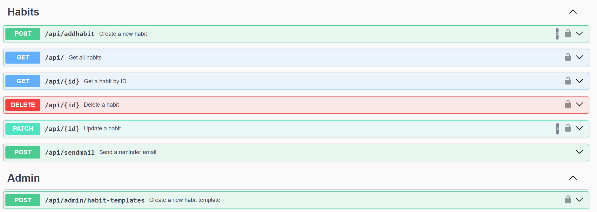

# Habit Management API

## Overview
This project is a backend API built with Node.js and MongoDB that provides functionality for user authentication, habit management, and habit tracking. It includes features for secure user login, CRUD operations for habits, daily reminders, and admin controls.


## Table of Contents
- [Features](#features)
- [Requirements](#requirements)
- [Technologies Used](#technologies-used)
- [Installation](#installation)
- [Usage](#usage)
- [API Endpoints](#api-endpoints)
- [Database Models](#database-models)
- [Security](#security)
- [API Documentation](#api-documentation)
- [Contributing](#contributing)
- [License](#license)


## Features
1. **User Authentication**
   - JWT-based authentication for secure login and registration.
2. **Habit Management**
   - CRUD endpoints for creating, updating, deleting, and viewing habits.
   - Habit data includes streaks, daily progress, and frequency settings.
3. **Reminders & Notifications**
   - Daily notification scheduler (using cron job) to remind users of pending habits.
4. **Admin Controls**
   - Admin users can view all users and their habit completion stats.
   - Admins can create habit templates for users to adopt.

## Prerequisites
- Node.js (version 14 or higher)
- MongoDB (local or cloud instance)


 ## fitness Swagger UI
   
   
   <br>

   

## Technologies Used
- Node.js
- Express.js
- MongoDB
- JWT (JSON Web Token)


### Setup .env file

```bash
DATABASE_URL=Your_mongo_url
PORT=Sevice_port
NODE_ENV=NODE_ENVIRINMENT
JWT_SECRET=jwt_secret
```

### Run this app locally

```shell
npm run build
```

### Start the app

```shell
npm start
```
